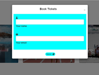
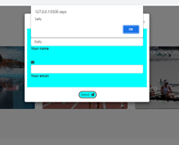
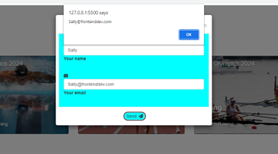
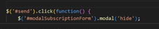
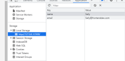

# Paris-Olympics

## Description

For our team project we have been asked to produce an interactive website that is responsive and has at least 2 APIs. 

The following criteria needs to be applied to our project.

Use Bootstrap.

Be deployed to GitHub Pages.

Be interactive (in other words, accept and respond to user input).

Use at least two server-side APIs Links to an external site..

Use modals instead of alerts, confirms, or prompts.

Use client-side storage to store persistent data.

Be responsive.

Have a polished UI.

Have a clean repository that meets quality coding standards (file structure, naming conventions, best practices for class/id naming conventions, indentation, quality comments, and so on).

Have a quality README (including a unique name, description, technologies used, screenshot, and link to the deployed application).

We originally decided that we would create a web page to include a holiday theme, however we found some of the api data for holidays a bit too overwhelming for a first group project. We also considered creating a movie website app but decided that because this had already been covered that we needed a different theme. We settled on a Paris Olympics theme because it covered holiday data and there were lots of api data that we could use for the project we also felt that it was unique and solved a real life scenario.

# User Story
To produce a responsive website for users looking for information about the Paris Olympics 2024. The user would like to be able to check out venues in France if visiting for the olympics and be able to convert currency from one currency value into euros. The user would like to be able to find out how many days are available until the Olympics. The user can return to the website to view current information about the olympics.

# Achievements

We were able to achieve the tasks set in the brief and to achieve this we did the following:

used an api that pulled data on hotels in France when the user opened up a calendar with an arrival data and a departure date the api listed hotel(s) in the area and displayed details like the price of the hotel.

We produced an api where the user selected a currency and entered the amount of money and this converted the value into euros.
We produced a third api that when a country was selected an image of the Country flag was displayed.

We applied bootstrap frameworks for all of the sections in the html to the Nav bar, image cards, modal and added a flexbox model for some of the api data.

Our web page has lots of interactivity from the user clicking on the apis to the countdown timer and a book tickets button that opens up a modal. 

When the user clicks on the modal and enters their name and e-mail this is stored in the local storage.

Through working on a simple wireframe and adding bootstrap markup we were able to create a responisve page that can be used on different devices.

We have tied up our repository to make it look cleaner and easier for anyone to navigate in the repository. 

Once working on the functionality we have looked at the wireframe and worked on getting the UI to look aesthetically pleasing.

# Issues
Our main issues were working collaboratively on github as we all have basic knowledge of github but got lost when pushing and pulling as this was unfamilar to most of us. We had quite a few collisions and our repository was a little untidy. One member of the group was experienced in using github and was able to coach us and show us how to resolve data collisions and issues with pushing and pulling data and making sure that we were on the right branches.

There were issues with setting up the modal originally the code from the bootcamp third party api and local storage student tasks were applied using query selector code but there were issues linking this to the send button and an HTML anonymous error kept occuring. The code was change to getElementById and this code seemed to work without any issues.

We originally wanted to use an api map but found that a lot of the api map data like google maps required payments so we were limited. We did investigate using the tomtom data but ran out of time and already had three successful working apis.

# Improvements

There was a lot more scope for this project and given more time we could have done the following:

Added a jumbotron image on the front page of Paris landmarks or olympians to modernise the look of the page.

We could have cross referenced the apis and used the currency data so when the user chose their hotel on the hotel api it converted the hotel cost to their countries currency and showed this converted into euros.

We could have added more pages which include information about events and a latest news page that pulls the most recent news api data about the Olympics.

Got the navbar fully functioning to got to additional pages to include information about the athletes, newsfeed page and event itinerary - when published.
   

## Table of Contents (Optional)

If your README is long, add a table of contents to make it easy for users to find what they need.

- [Installation](#installation)
- [Usage](#usage)
- [Credits](#credits)
- [License](#license)

## Installation

## Usage

Provide instructions and examples for use. Include screenshots as needed.

To add a screenshot, create an `assets/images` folder in your repository and upload your screenshot to it. Then, using the relative file path, add it to your README using the following syntax:

## Contributors

Rajoo Uddin, Reagan Rodrigues, Sally Hedges, Sandra Antohe, Seyed Parsa Hemmati Hosseini

## Credits

We used the following resources to help us:

API data

We went to this website to access data on hotels
"https://booking-com.p.rapidapi.com/v1/hotels/search?dest_id="+ 

We looked at this URL for the currency conversion data
https://api.freecurrencyapi.com

We went to this website to find countries and images of the flags
https://restcountries.com/v3.1/all

To help me work out how to apply jquery to my code
https://api.jquery.com/jQuery.ajax/#jQuery-ajax-settings-settings

modal designs for bootstrap

https://mdbootstrap.com/docs/b4/jquery/modals/forms/

Support with local storage

https://www.youtube.com/watch?v=LfeOLVGHiXI&t=242s

 Aditi's video on creating forms and saving to local storage

 https://www.google.com/search?q=how+to+add+local+storage+to+form&rlz=1C1SQJL_enGB1032GB1032&oq=how+to+add+local+storage+to+form&aqs=chrome..69i57j33i160l4j33i15i22i29i30.18880j0j7&sourceid=chrome&ie=UTF-8#fpstate=ive&vld=cid:b634fbd9,vid:hG0YDpePCjI
 

## License

We have chosen a MIT license for this project

## Features

## Tests

Nav Bar
Test to see if Nav Bar buttons and links go to each section

Hotel Search API

Test button 1 to see if when button for region is clicked details/image of hotel will appear
Test button 2 to see if when button for region is clicked details/image of hotel will appear
Test button 3 to see if when button for region is clicked details/image of hotel will appear
Test to check correct number of hotels required is selcted and appended to page

Currency Converter API
Test to see if currency api converts from one curency to euros
Test to see if currency api converts from another currency to euros
Check and compare on currency convertor websites to check conversion is accurate

Modal 
Test to see if Book Tickets button is pressed modal  When t pressed the modal appears on the top middle centre of the page

Test to see if when data is input for name and send button is pressed this is connected.
Alert shows that when variable (name) is entered into the first input it will enter the data that the user enters

Test to see if when data is input for e-mail and send button is pressed this is connected.
Alert shows that when variable (email) is entered into the second input it will enter the data that the user enters

Test to see if when data is entered and modal send button is pressed the modal disappears

Test to see if data saves to local storage.
When the data is entered into the modal form and the send button is clicked data is saved and shown in local storage.

